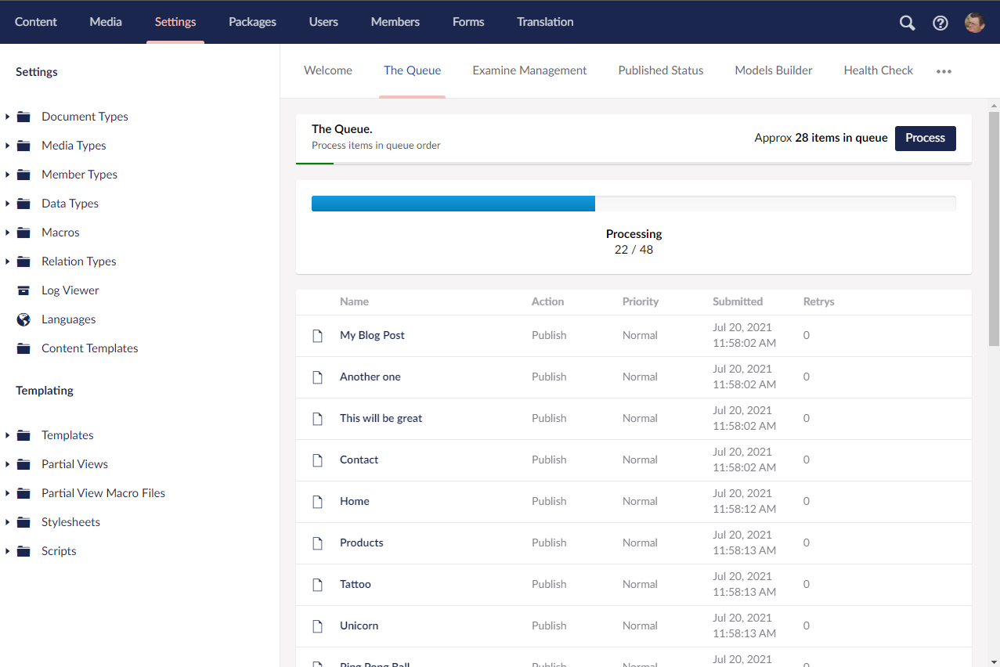

# The Queue for Umbraco 

A background processing queue - that lets you send stuff off into the 
background to get done while you don't have to think about (or babysit) it.

## Features
The Queue is a simple yet powerful thing, on the face of it - you can queue content to be published. underneath you can add anything you can imagine to the queue and have code fire as things reach the top. 

### Send to Queue
Quickly send content to the queue to be published in the backgoround

### Super flexible custom actions
Write your own custom queue actions, fire things into the queue and 
get your custom code to run when they reach the top. 

